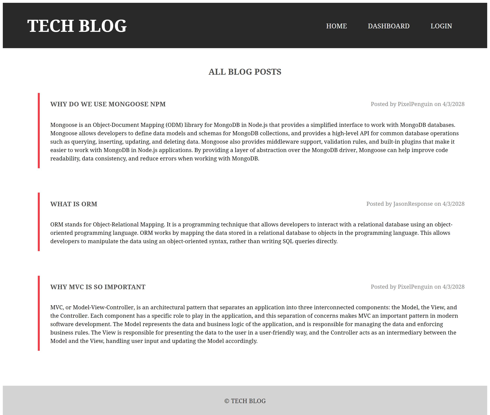

# TECH BLOG

  
## Description
  
CMS-style blog site where developers can publish their blog posts and comment on other developers’ posts. This app follows the MVC paradigm in its architectural structure, using Handlebars.js as the templating language, Sequelize as the ORM, and the express-session npm package for authentication.

## Table of Contents

- [Screenshots](#screenshots)
- [Deployment](#deployment)
- [Usage](#usage)
- [License](#license)
- [How to Contribute](#how-to-contribute)
- [Questions](#questions)

## Screenshots

## Deployment

[https://dry-journey-24079.herokuapp.com/]
  
## Usage
  
Click on the [link](https://dry-journey-24079.herokuapp.com/) to access the Tech Blog web page.
  
## License
    
This project is licensed under the [MIT](https://opensource.org/licenses/MIT) license.
  
## How to Contribute
  
Please follow [Contributor Covenant](https://www.contributor-covenant.org/) Code of Conduct
  
## Questions
  
Open an issue if you have any questions about the repo. You can find more of my work [here](https://github.com/hannazo).